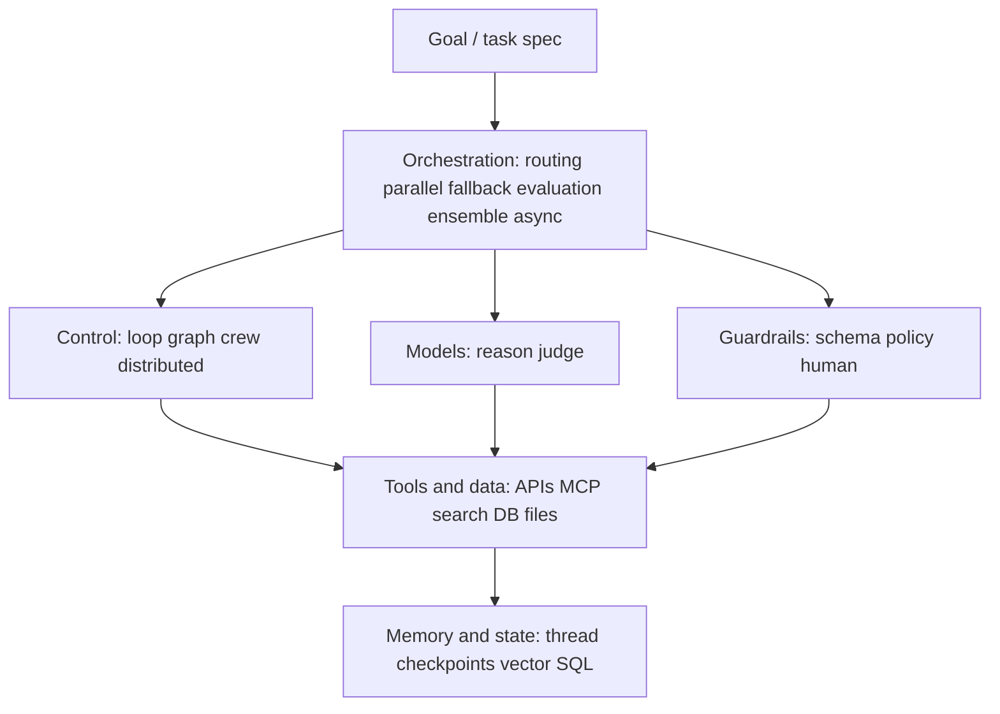

# Agentic AI — simple mental map

One place to fit **definitions**, **architecture**, **patterns**, and **frameworks**.  
Vendors only swap *pieces* inside the same boxes.

---

## 1. One-sentence meaning

**Agentic AI** = an LLM-driven system that **decides what to do next** using **tools**, **memory**, and/or **other agents**, in **several steps**, until a **goal** is met — not a single fixed script you wrote in advance.

---

## 2. Main architecture (flow)

```
                         ┌─────────────────────────┐
                         │   GOAL / TASK SPEC      │
                         └───────────┬─────────────┘
                                     │
                         ┌───────────▼───────────────┐
                         │ ORCHESTRATION & EXECUTION  │
                         │  routing · parallel        │
                         │  fallback · evaluation     │
                         │  ensemble · async          │
                         └───────────┬───────────────┘
                                     │
     ┌───────────────────────────────┼───────────────────────────────┐
     ▼                               ▼                               ▼
┌─────────────┐              ┌─────────────┐              ┌─────────────┐
│  CONTROL    │              │  MODEL(S)  │              │ GUARDRAILS  │
│  who runs   │              │  who thinks│              │  what is    │
│  the loop   │              │  / judges  │              │  allowed    │
└──────┬──────┘              └──────┬──────┘              └──────┬──────┘
       │                            │                            │
       └────────────────────────────┼────────────────────────────┘
                                    ▼
                         ┌─────────────────────┐
                         │   TOOLS & DATA      │
                         │  how it acts        │
                         │  (+ MCP as plug)    │
                         └──────────┬──────────┘
                                    ▼
                         ┌─────────────────────┐
                         │ MEMORY & STATE      │
                         │ what it keeps       │
                         └─────────────────────┘
```

### Short labels

| Box | Plain English |
|-----|----------------|
| **Goal** | What “done” looks like. |
| **Orchestration** | How calls are **scheduled**: split work, run in parallel, retry, judge outputs, merge opinions. |
| **Control** | **Who owns the loop**: simple chat loop, graph, crew, or distributed messaging. |
| **Model(s)** | **Who thinks**; can be one model or many; **worker** vs **judge** roles. |
| **Guardrails** | **Rules and contracts**: JSON/schema, policies, **human approval** when needed. |
| **Tools & data** | **Actions**: APIs, DB, search, files, browser; **MCP** = standard way to plug those in. |
| **Memory & state** | **What persists**: chat thread, **checkpoints**, vectors, SQL, key-value. |

---

## 3. Multi-model patterns (orchestration)

These are **strategies** for using more than one model or path — not brand names.

| Pattern | What it does |
|--------|----------------|
| **Routing** | Send each subtask to the **best** model or path. |
| **Parallel** | Run **several** model/tool calls **at the same time**, then merge. |
| **Fallback** | If error, timeout, or bad quality → **switch** model or path. |
| **Evaluation** | One model **produces**; another (or rules) **scores** or **rejects**. |
| **Ensemble** | Many models answer **in part** → you **merge**, **vote**, or **rerank**. |

**Async** = run things without blocking the whole run; it often pairs with **Parallel**.

---

## 4. Side tracks (everywhere, not one box)

These **cut across** the whole system:

| Track | Why it matters |
|------|----------------|
| **Observability** | Traces and spans so you can **debug** long multi-step runs. |
| **Product** | UI (e.g. chat), **user sessions**, **deploy** (e.g. cloud / hosted app). |
| **MCP** | **Same tools** from different apps: one host, **many** MCP servers. |
| **Distribution** | Agents in **different processes** or machines talking over messages/RPC. |
| **Human-in-the-loop** | **Approve** or **stop** before risky or costly actions. |

---

## 5. Theory checklist (compact)

| Idea | Question it answers |
|------|---------------------|
| Autonomy spectrum | Fully scripted ↔ model chooses each next step. |
| Workflow vs agent | Fixed steps vs branching + tools. |
| Orchestration | Who routes work to models/tools/agents. |
| Multi-agent | Roles, handoff, debate, worker/judge, agents-as-tools. |
| Structured I/O | Contracts: JSON, Pydantic, tool schemas. |
| Feedback loops | Generate → evaluate → fix until good enough. |
| Observability | Why did this long run fail? |
| Async / parallel | Don’t block the whole run on one call. |

---

## 6. Frameworks = same map, different names

| Framework | Main idea | Simple example |
|-----------|-----------|----------------|
| **OpenAI Agents SDK** | Runner + agents + **traces** | Sales flow: tools + handoff to specialist |
| **CrewAI** | Crew / roles / **tasks** | Search → analyze → write |
| **LangGraph** | **Graph**: nodes, edges, **state**, **checkpoints** | Branching flow + saved state |
| **AutoGen** | Chat + (**Core**) **messaging** | Coder + reviewer in a loop |
| **MCP** | **Not** a full brain by itself | One app, many tool servers (search, DB) |

MCP = **tools & data** + **integration** layer. It does **not** replace **control** or **orchestration**.

---

## 7. Box-by-box guide (framework examples)

Same boxes for every stack—only API names change. One example per framework where it fits best.

### 7.1 Goal / task spec

**What it is:** What “done” looks like: user request, ticket, or objective (often with desired output shape).

**Why it matters:** Routing, tools, and memory are judged against this.

**Framework angle:** **CrewAI** → task descriptions; **LangGraph** → initial state / first node input; **OpenAI Agents SDK** → user message / run input; **AutoGen** → first message or task string to the group.

---

### 7.2 Orchestration & execution

**What it is:** How work is **scheduled**: split, parallelize, retry, judge, merge—not the wording of the answer, but the **plan of calls**.

**Why it matters:** Cost, latency, and reliability live here.

| Framework | Example |
|-----------|---------|
| **OpenAI Agents SDK** | `async` runs; parallel tool/agent calls; retry or alternate path on failure (**fallback**). |
| **CrewAI** | Which agent gets which task; sequential vs hierarchical **process** (**routing**-like). |
| **LangGraph** | Parallel branches; grader node before continue (**evaluation**); checkpointer resume after failure. |
| **AutoGen** | Multiple agents in parallel in group chat; critic agent (**evaluation**). |
| **MCP** | Usually **not** the orchestrator—the **host** still orders steps; MCP supplies tools when invoked. |

---

### 7.3 Control (who runs the loop)

**What it is:** Shape of the program: simple loop, **graph**, **crew** process, or **distributed** messaging.

| Framework | Example |
|-----------|---------|
| **OpenAI Agents SDK** | **Runner** drives the loop; **handoffs** move control to another agent. |
| **CrewAI** | **Crew** + **process** defines order (e.g. sequential tasks). |
| **LangGraph** | **Nodes + edges** (including conditional edges). |
| **AutoGen** | **Group chat** or **Core** routing—who speaks/acts next. |
| **MCP** | No loop—the **host** (your app or agent framework) owns control. |

---

### 7.4 Model(s) (think / judge)

**What it is:** LLM(s) for reasoning, tool choice, or **judging** another output (worker vs evaluator).

| Framework | Example |
|-----------|---------|
| **OpenAI Agents SDK** | Each **Agent** bound to a **model**; multiple agents = multiple models/roles. |
| **CrewAI** | Each **Agent** can set `llm=`; different agents → different models. |
| **LangGraph** | One node calls an LLM; another node can be a **grader** model. |
| **AutoGen** | Assistant vs second agent as **evaluator** with another model. |
| **MCP** | Models sit in the **host**; MCP does not pick the model. |

---

### 7.5 Guardrails (what is allowed)

**What it is:** Contracts and policies: JSON/schema, Pydantic, blocklists, budgets, **human approval** before dangerous tools.

| Framework | Example |
|-----------|---------|
| **OpenAI Agents SDK** | Validate tool args and final output; **traces** show where a rule failed. |
| **CrewAI** | **Pydantic** / structured **expected_output** on tasks. |
| **LangGraph** | Validate state after a node; conditional edge → repair node if invalid. |
| **AutoGen** | Structured content in messages; termination or human proxy as a gate. |
| **MCP** | Server can enforce auth and expose only safe tools; host should still validate side effects. |

---

### 7.6 Tools & data (how it acts)

**What it is:** Side effects and reads: APIs, DB, search, files, browser—surfaced as **tools** (or resources).

| Framework | Example |
|-----------|---------|
| **OpenAI Agents SDK** | Python **tool** functions; model emits `tool_calls`, your code executes. |
| **CrewAI** | **Tools** on agents (search, custom API). |
| **LangGraph** | **ToolNode** or custom node wrapping an API. |
| **AutoGen** | `register_function` / tool use in chat. |
| **MCP** | **MCP server** exposes tools; host maps them to the model—**same server** can plug into many hosts. |

---

### 7.7 Memory & state (what it keeps)

**What it is:** Anything **persistent** across steps: thread history, **checkpoints**, vectors, SQL, KV.

| Framework | Example |
|-----------|---------|
| **OpenAI Agents SDK** | Session/conversation state each turn; trace store for debugging. |
| **CrewAI** | Crew/agent **memory**; passing outputs **task → task**. |
| **LangGraph** | **State** object + **checkpointers** (e.g. SQLite)—resume and thread memory. |
| **AutoGen** | Chat **history**; Core may persist depending on setup. |
| **MCP** | **Resources** (files, URIs); long-term memory is usually **your** DB + optional resource reads. |

---

### 7.8 Side tracks (quick examples)

| Track | Framework example |
|------|-------------------|
| **Observability** | Agents SDK **traces**; **LangSmith** with LangGraph/LangChain. |
| **Product** | **Gradio** (or any UI) around any stack. |
| **MCP integration** | One host + search + DB MCP servers. |
| **Distribution** | **AutoGen Core** / multi-process agents. |
| **Human-in-the-loop** | LangGraph human node; AutoGen human proxy; app-level approval in Agents SDK. |

**Reading order:** Goal → Orchestration → Control / Models / Guardrails → Tools → Memory. Side tracks apply everywhere.

---

## 8. One-page text mind map

```
AGENTIC AI
│
├─ Meaning: goal + many steps + decisions + tools / memory / agents
│
├─ Core architecture
│  ├─ Goal
│  ├─ Orchestration (routing, parallel, fallback, evaluation, ensemble, async)
│  ├─ Control (loop, graph, crew, distributed)
│  ├─ Model(s) + evaluators
│  ├─ Guardrails + structured output + human gates
│  ├─ Tools & data (incl. MCP)
│  └─ Memory & state
│
├─ Side tracks: observability · product · MCP multi-server · distribution · human
│
├─ Theory: workflow vs agent · multi-model patterns · handoff · feedback loops
│
└─ Frameworks: Agents SDK · CrewAI · LangGraph · AutoGen · MCP
```

---

## 9. When you learn something new, ask

1. **Which box?** — control · orchestration · model(s) · guardrails · tools/data · memory  
2. **Which pattern?** — routing · parallel · fallback · evaluation · ensemble (or none)  
3. **Which framework piece?** — e.g. node, task, handoff, checkpoint, MCP server  
4. **Which side track?** — observability · product · integration · distribution · human  
5. **What contract?** — schema, tool definition, or rule between LLM and code  

---

## 10. Diagram (Mermaid)

Paste-friendly version for tools that render Mermaid:



---

*This doc stays conceptual — no vendor lock-in; swap implementations inside the same boxes.*
