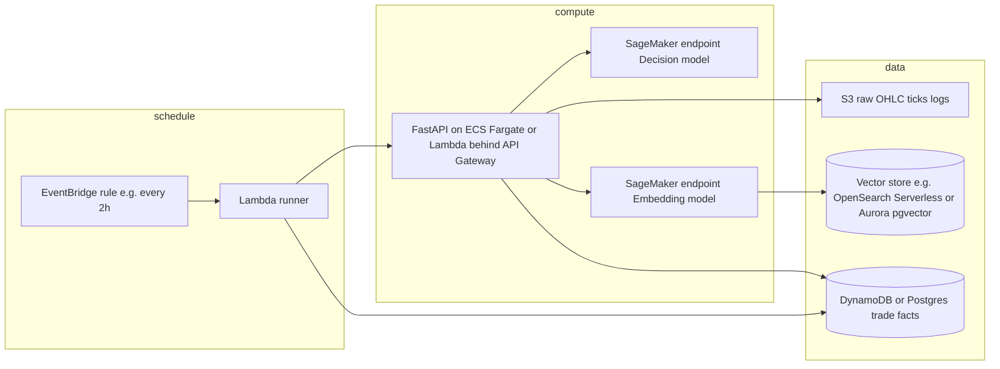
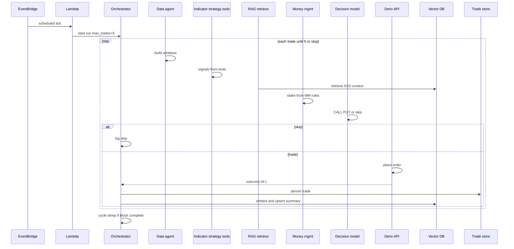

# Deriv AI bot — multi-agent platform architecture

Architecture crawl: **multi-agent control plane**, **AWS** (EventBridge, Lambda, SageMaker, RAG/vector), **money management** (spreadsheet-style cycle), and **FastAPI** for APIs and trade “cards.”

Strategies, indicators, and data-gathering mechanisms are expected to be **ported** from the sibling project `deriv_bot_ai` (or equivalent); this doc names **roles and integration points**, not that repo’s file layout.

---

## 1. Purpose

A **multi-agent** system over a **Deriv** trading workflow that:

- Pulls **market data**, runs **strategies** and **indicators** (exposed as **tools** to agents).
- Uses **one model path** for **semantic RAG** (embeddings + retrieval) and **another** for **direction / decision** (e.g. SageMaker or Amazon Bedrock).
- Runs on a **schedule** (e.g. **every 2 hours**), executes up to **N trades per run** (e.g. **5**), and respects **money-management cycles** (e.g. **10 trades** per block, then **sleep** / pause until the next policy window).
- Persists **every closed trade** (win/loss, stake, profit, context) into **vector + structured** storage so agents can query **5- or 10-trade windows** (semantic + exact).
- Exposes a **FastAPI** service: trade lists, run status, and **trade cards** (pre/post window, PnL, indicator snapshot, TA tags, RAG context).

---

## 2. Multi-agent roles

| Agent / role | Responsibility |
|--------------|----------------|
| **Orchestrator (control)** | Starts a **run**, loads config/env, enforces **max trades per run**, **cycle sleep** after a full MM block, orders sub-agents, handles failures and idempotency. |
| **Data agent** | Ingests OHLC/ticks, builds **feature windows** (before/after trade context), normalizes time/symbol/timeframe. |
| **Indicator / strategy agent** | Calls **tools**: ported **indicators** + **strategy rules**; outputs **signals**, parameters, and **TA category** metadata. |
| **Direction / decision agent** | Consumes signal + optional RAG context; outputs **CALL / PUT / skip**, confidence, optional duration (integrates the “different model” for direction). |
| **Money-management (MM) agent** | Given **risk capital**, **payout**, **target wins in window**, **trades left in cycle**, computes **stake** and **available risk capital** (progressive staking aligned with the trading spreadsheet). |
| **Memory / RAG agent** | After each trade: **encode** summary (SageMaker embedding endpoint or Bedrock), **upsert** to vector index; **retrieve** last **5/10** events for the decision path. |
| **(Optional) Evaluator / guardrail** | Volatility, spread, max daily loss, news gap — can **veto** or **downsize** before execution. |

**Mental model mapping** (see `agentic-ai-mental-map.md`): **Goal** = run + symbol + risk policy; **Orchestration** = schedule + trades-per-run + cycle; **Control** = orchestrator; **Models** = decision + embedding; **Guardrails** = risk + skip rules; **Tools** = indicators/strategies; **Memory** = RAG + trade store.

---

## 3. Money management (spreadsheet-aligned)

The business spreadsheet uses ideas such as: **risk capital seed**, **10 trades per block**, **target win count** (e.g. 60% → 6 wins), **payout per $1 staked** (e.g. **1.95**), **dynamic stake**, and **available risk capital** after each result.

### 3.1 Config parameters (env / config file)

| Parameter | Description (example) |
|-----------|------------------------|
| `MM_SEED_RISK` / `RISK_CAPITAL_SEED` | Starting pool for a cycle (e.g. **5.00**). |
| `MM_CYCLE_LEN` | Trades per block (e.g. **10**). |
| `MM_TARGET_WINS` or `MM_TARGET_WIN_RATE` | Target wins in the block, or rate (e.g. **6** or **0.6**). |
| `MM_PAYOUT_RATIO` | Return model parameter (e.g. **1.95**) — **must match** broker contract math. |
| `MM_MIN_STAKE` / `MM_MAX_STAKE` | Hard safety bounds. |
| `MM_CYCLE_SLEEP_SECONDS` | Sleep after a full **MM_CYCLE_LEN** (or defer to next EventBridge only). |

**Important:** The exact **stake formula** should be **copied from the verified Excel logic** (or defined explicitly in code + tests). The sheet’s `#VALUE!` rows suggest stake is **formula-driven**; version the formula in config (`MM_FORMULA_VERSION`) so backtests match production.

### 3.2 Profit accounting (typical binary-style check)

Clarify with the broker: if **payout** is “return per $1 staked,” net profit on a win is often **stake × (payout − 1)**. Loss is usually **−stake**. Encode the same rules the spreadsheet uses.

---

## 4. AWS physical architecture (recommended)

**Notes**

- **EventBridge → Lambda**: ideal to **trigger** a run. If orchestration exceeds Lambda **timeout**, use **SQS + Fargate worker**, or **Step Functions**, or run the **orchestrator** on **Fargate** and let Lambda only enqueue.
- **“S3 vector bucket”**: raw artifacts can live in **S3**; **similarity search** still needs a **vector index** (OpenSearch Serverless, pgvector, etc.), not S3 alone.
- **SageMaker**: “encoding” = **embedding** endpoint; “direction” = separate **inference** endpoint (or use **Bedrock** for one or both to reduce ops).

---

## 5. Scheduling and trade limits

| Policy | Suggested implementation |
|--------|---------------------------|
| **Every 2 hours** | EventBridge `rate(2 hours)` or cron; idempotency key per window. |
| **5 trades per run** | Orchestrator counter; persist `run_id` + `trades_executed` in **DynamoDB** (or DB). |
| **10-trade MM cycle + sleep** | `cycle_index` 1..`MM_CYCLE_LEN`; on completion, set state **SLEEPING** until `MM_CYCLE_SLEEP_SECONDS` or next business rule. |

---

## 6. Data model: facts + RAG

### 6.1 Structured trade record (DynamoDB or SQL)

- `trade_id`, `run_id`, `symbol`, `timeframe`
- `opened_at`, `closed_at`, `result` (W/L)
- `stake`, `profit`, `available_risk_after`, `payout_used`
- `direction`, `strategy_name`, `indicator_snapshot_id` (or inline JSON)
- `cycle_index`, `mm_formula_version`
- `embedding_id` or `vector_doc_id`

### 6.2 RAG document (embedded text)

- Short **narrative summary**: outcome, stake, profit, key indicator values, regime.
- **Tags** for filter: `ta_category`, `strategy`, `window_5`, `window_10`.

### 6.3 Retrieval for the “5 or 10 window” agent

1. **Exact** last N trades from the **trade store** (fast, reproducible).
2. **Semantic** search over the **vector index** (regime similarity, not only the last N).

---

## 7. FastAPI (APIs for UI and operators)

| Area | Examples |
|------|----------|
| **Runs** | `POST /runs` (manual trigger), `GET /runs/{id}` (status, trades done, next wake). |
| **Trades** | `GET /trades` (paginated W/L, stake, profit). |
| **Trade card** | `GET /trades/{id}/card`: **pre-trade window** (OHLC + indicators), **post-trade window**, **PnL**, **TA tags**, **RAG snippets** used at decision time, **MM state** snapshot. |

Optional: **WebSocket/SSE** for live quotes in the UI; the **scheduled bot** can remain REST-only.

---

## 8. Sequence: one scheduled run

---

## 9. Environment variables (checklist)

| Variable | Role |
|----------|------|
| `DERIV_APP_ID`, `DERIV_TOKEN` (or OAuth) | Broker API access |
| `DERIV_SYMBOL`, `DERIV_ACCOUNT` | Scope |
| `SCHEDULE_CRON` or use EventBridge only | When the bot runs |
| `TRADES_PER_RUN` | e.g. **5** |
| `MM_*` | See section 3.1 |
| `SAGEMAKER_EMBEDDING_ENDPOINT` / `SAGEMAKER_DECISION_ENDPOINT` | Or Bedrock model IDs |
| `VECTOR_INDEX_*` / `PGVECTOR_DSN` / `OPENSEARCH_*` | Vector store |
| `TRADE_STORE_*` (table name, DSN) | Facts |
| `S3_BUCKET_RAW` | Archives / features |
| `FASTAPI_*` (secret, CORS) | API hardening |

Use **AWS Secrets Manager** or **SSM Parameter Store** for tokens and keys in production.

---

## 10. Risks and compliance

- **Deriv / binary-style products** carry high risk; implement **hard limits** (max daily loss, max stake, max trades) and **demo** mode.
- **Lambda limits**: move long runs to **Step Functions** or **Fargate** if needed.
- **Auditing**: log **model version** (decision + embedding) and **MM formula version** per trade.

---

## 11. Next implementation steps (repo)

1. Port **strategies**, **indicators**, and **data gathering** from `deriv_bot_ai` behind a stable **tool API** (pure functions + schemas).
2. Implement **orchestrator** + **MM agent** with tests that mirror the spreadsheet for known sequences.
3. Wire **FastAPI** + **scheduled Lambda** (or Step Functions) + **vector ingest** on trade close.

---

*Document version: 1.0 — aligns with `docs/agentic-ai-mental-map.md` concepts.*

---

## Related docs

- **`platform-breakdown.md`** — agents (inputs/outputs), FastAPI routes, DB + RAG field-level models, infrastructure components and consolidation options.
