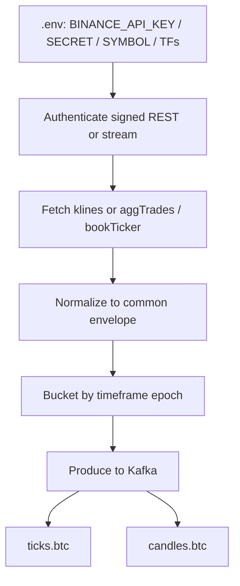
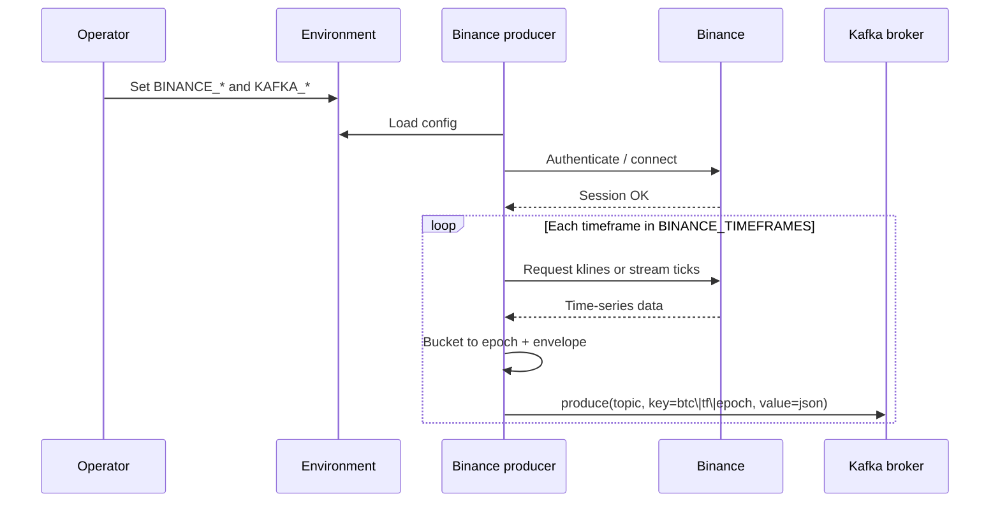

# Binance time series → Kafka

Pull Binance BTC time series, authenticate with env-based API credentials, normalize by timeframe, publish to Kafka with **time-based partition keys**.

No producer code in this pass — contracts and flow only. Later implementation notes append to this same doc.

## Goal

```text
Binance API  →  normalize (1s / 2s / 1m / …)  →  Kafka ticks.btc + candles.btc
```

## Flow chart



## Auth (client app → env)

Binance REST/WebSocket trading or market data that needs a key uses API key + secret from env. **Never commit real values.**

| Variable | Required | Purpose |
|----------|----------|---------|
| `BINANCE_API_KEY` | Yes (when using signed endpoints) | Client identity |
| `BINANCE_API_SECRET` | Yes (signed) | HMAC signing |
| `BINANCE_BASE_URL` | No | Default `https://api.binance.com` (or testnet URL) |
| `BINANCE_SYMBOL` | Yes | e.g. `BTCUSDT` |
| `BINANCE_TIMEFRAMES` | Yes | Comma list, e.g. `1s,2s,1m` |
| `KAFKA_BOOTSTRAP_SERVERS` | Yes | e.g. `localhost:9092` |
| `KAFKA_TOPIC_TICKS_BTC` | No | Default `ticks.btc` |
| `KAFKA_TOPIC_CANDLES_BTC` | No | Default `candles.btc` |

Public market streams may work without a key for some endpoints; still keep the same env layout so switching to signed/user data is one step.

## Time series we take from Binance

| Timeframe | Role | Source idea |
|-----------|------|-------------|
| `1s` | Fast path / align with gold 1s | Build from trades / book updates, or 1s kline if available |
| `2s` | Slightly coarser fast bar | Aggregate two 1s buckets or dedicated poll |
| `1m` | Primary higher TF for later entries | Binance kline `1m` |

Later (not Phase 1 code): `2m`, `3m`, `5m` as env-driven list.

## Kafka publish rules

1. **Topics:** `ticks.btc`, `candles.btc` (see [kafka-local.md](../../infrastructure/kafka-local.md)).
2. **Key (partition by time):**

   ```text
   btc|{timeframe}|{bucket_epoch}
   ```

   Example: `btc|1m|1710000000`

3. **Value:** JSON envelope:

   ```json
   {
     "entity": "btc",
     "source": "binance",
     "symbol": "BTCUSDT",
     "timeframe": "1s",
     "bucket_epoch": 1710000000,
     "event_time_ms": 1710000000456,
     "payload": {
       "open": 0,
       "high": 0,
       "low": 0,
       "close": 0,
       "volume": 0,
       "trade_count": 0
     }
   }
   ```

   For tick messages, `payload` is price + quantity (+ optional side), not full OHLCV.

## Sequence diagram



## Future code location

When implementation starts, place code under something like:

```text
workers/ingest/binance/   # or producers/binance/
```

Until then, this folder holds **docs only**.

## Out of scope here

- Consumer groups / volume window
- Materials topic
- Deriv gold (see [deriv-gold-kafka.md](../../deriv/producer/deriv-gold-kafka.md))
- Live trading
