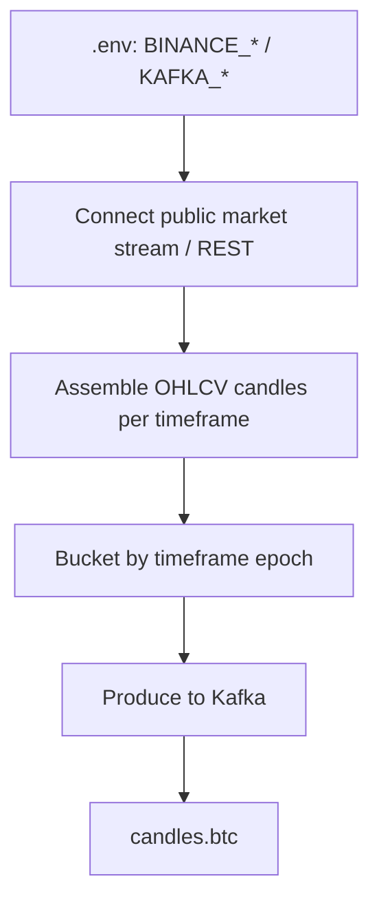
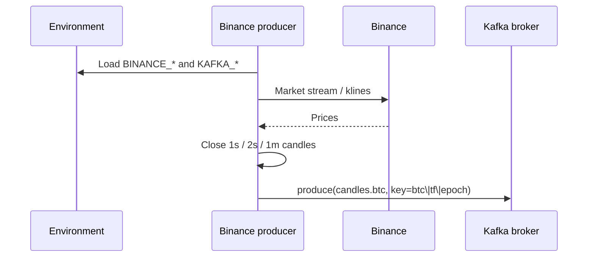

# Binance time series → Kafka

Pull Binance BTC market data, build **candles** (including 1s), publish to Kafka with **time-based partition keys**.

No tick topics — Kafka stores candle time series only.

## Goal

```text
Binance API  →  normalize candles (1s / 2s / 1m / …)  →  Kafka candles.btc
```

## Flow chart



## Auth (client app → env)

| Variable | Required | Purpose |
|----------|----------|---------|
| `BINANCE_API_KEY` | No for public data | Optional signed endpoints later |
| `BINANCE_API_SECRET` | No for public data | HMAC signing later |
| `BINANCE_BASE_URL` | No | Default `https://api.binance.com` |
| `BINANCE_SYMBOL` | Yes | e.g. `BTCUSDT` |
| `BINANCE_TIMEFRAMES` | Yes | e.g. `1s,2s,1m` |
| `KAFKA_BOOTSTRAP_SERVERS` | Yes | e.g. `localhost:9092` |
| `KAFKA_TOPIC_CANDLES_BTC` | No | Default `candles.btc` |

## Timeframes

| Timeframe | Role |
|-----------|------|
| `1s` | Fast path / align with gold 1s |
| `2s` | Coarser fast bar |
| `1m` | Higher TF (native kline + builder) |

## Kafka publish rules

1. **Topic:** `candles.btc` only (see [kafka-local.md](../../infrastructure/kafka-local.md)).
2. **Key:**

   ```text
   btc|{timeframe}|{bucket_epoch}
   ```

3. **Value:** candle envelope with OHLCV payload.

## Sequence diagram



## Code location

```text
workers/app/main.py                 # FastAPI + lifespan worker pool
workers/app/pool.py                 # ProducerWorkerPool
workers/app/producers/binance.py    # Binance BTC candles → Kafka
workers/.env.example
```

```bash
cd workers
cp .env.example .env
uv sync
uv run uvicorn app.main:app --host 0.0.0.0 --port 8081
```

## Out of scope here

- Tick / trade Kafka topics
- Consumer volume windows / materials
- Deriv gold (see [deriv-gold-kafka.md](../../deriv/producer/deriv-gold-kafka.md))
- Live trading
