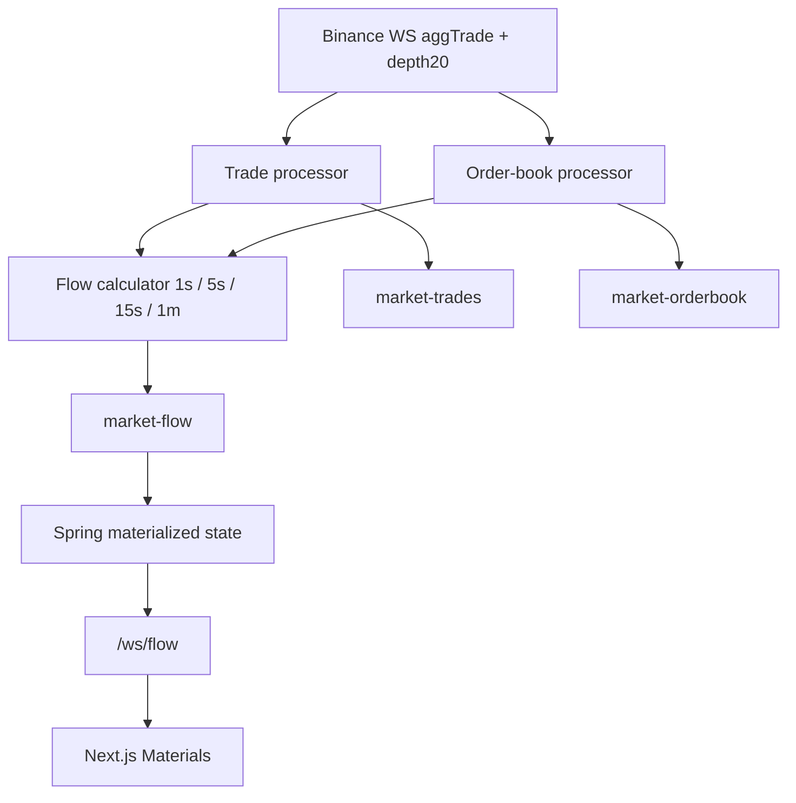

# Binance market-flow materials

Binance **only**. Aggressive buy/sell from **trades**. Resting liquidity from the **order book**. Never mix those sources.

## Flow



Kafka **key = symbol** (e.g. `BTCUSDT`) so one coin stays on one partition and stays ordered.

## Formulas (1s window)

| Metric | Source | Formula |
|--------|--------|---------|
| Buy volume | aggTrade taker buy (`m=false`) | sum qty |
| Sell volume | aggTrade taker sell (`m=true`) | sum qty |
| Delta | trades | Buy − Sell |
| Buy aggression | trades | Buy / (Buy + Sell) |
| Bid liquidity \(L_B\) | book | bid qty within 0.5% below last price |
| Ask liquidity \(L_S\) | book | ask qty within 0.5% above last price |
| Liquidity imbalance | book | \((L_B - L_S) / (L_B + L_S)\) |

Pressure: aggression &gt; 60% buying, &lt; 40% selling, else balanced.

Reaction v1 (not “wall = short”):

- Price sweeps into bid zone + heavy sell volume + price reclaims → `sell_absorbed_reclaim`
- Price sweeps into ask zone + heavy buy volume + price rejects → `buy_absorbed_reject`

## Topics

| Topic | Key | Cadence |
|-------|-----|---------|
| `market-trades` | `BTCUSDT` | every trade |
| `market-orderbook` | `BTCUSDT` | each closed 1s |
| `market-flow` | `BTCUSDT` | each closed 1s (materials) |

## Code

```text
workers/app/flow.py
workers/app/producers/flow.py
realtime-spring/.../FlowKafkaListener.java
realtime-spring/.../FlowWebSocketHandler.java
frontend/src/components/MaterialsPanel.tsx
```

## Env

```env
WORKER_ENABLE_BINANCE_FLOW=true
KAFKA_TOPIC_MARKET_FLOW=market-flow
BINANCE_FLOW_LIQUIDITY_PCT=0.005
```

Frontend: `NEXT_PUBLIC_WS_FLOW_URL=ws://localhost:8080/ws/flow`

## Out of scope

- Auto trade entry
- Deriv gold flow
- Open interest / funding / liquidations
