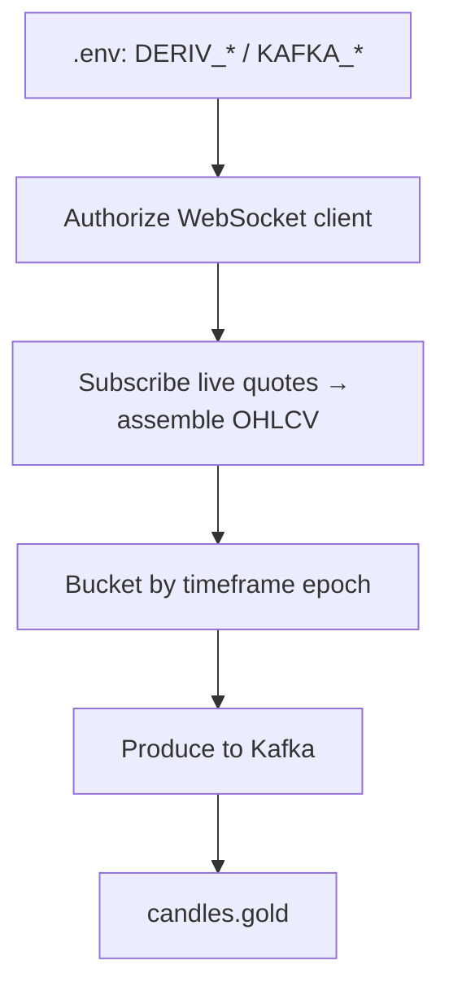
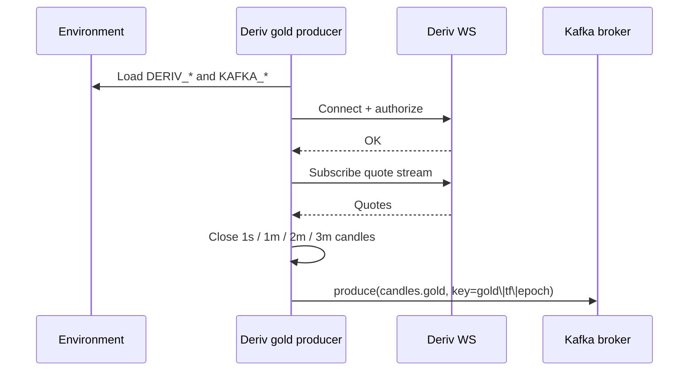

# Deriv gold → Kafka

Deriv **gold** candles (including 1s) → Kafka, same envelope and **time-based partition** scheme as Binance.

No tick topics — Kafka stores candle time series only. Deriv’s websocket quote feed may be used internally to build candles.

## Goal

```text
Deriv WebSocket  →  normalize gold candles (1s / 1m / 2m / 3m / …)  →  Kafka candles.gold
```

## Flow chart



## Auth (client app → env)

| Variable | Required | Purpose |
|----------|----------|---------|
| `DERIV_APP_ID` | No (default test `1089`) | App id query param |
| `DERIV_TOKEN` | Yes | Authorize |
| `DERIV_WS_ENDPOINT` | No | Default `wss://ws.derivws.com/websockets/v3` |
| `DERIV_SYMBOL` | Yes | e.g. `frxXAUUSD` |
| `DERIV_TIMEFRAMES` | Yes | e.g. `1s,1m,2m,3m` |
| `KAFKA_BOOTSTRAP_SERVERS` | Yes | e.g. `localhost:9092` |
| `KAFKA_TOPIC_CANDLES_GOLD` | No | Default `candles.gold` |

## Timeframes (gold)

| Timeframe | Role |
|-----------|------|
| `1s` | Align with BTC 1s |
| `1m` | Primary higher TF |
| `2m` | Mid structure |
| `3m` | Mid structure |
| `5m` | Later / env list |

## Kafka publish rules

1. **Topic:** `candles.gold` only
2. **Key:**

   ```text
   gold|{timeframe}|{bucket_epoch}
   ```

3. **Value:** candle envelope (OHLCV). Deriv volume may be quote-update count when true volume is absent.

## Sequence diagram



## Alignment with Binance

```mermaid
flowchart LR
  subgraph second_T["Wall clock second T"]
    B[btc\|1s\|T → candles.btc]
    G[gold\|1s\|T → candles.gold]
  end
  W[Future worker joins on bucket_epoch]
  B --> W
  G --> W
```

See [binance-time-series-kafka.md](../../binance/producer/binance-time-series-kafka.md).

## Code location

```text
workers/app/main.py               # FastAPI + lifespan worker pool
workers/app/pool.py               # ProducerWorkerPool
workers/app/producers/deriv.py    # Deriv gold candles → Kafka
workers/.env.example              # set DERIV_TOKEN
```

## Out of scope here

- Tick Kafka topics
- Volume-window / perspective candles
- Materials topic
- Trade placement on Deriv
