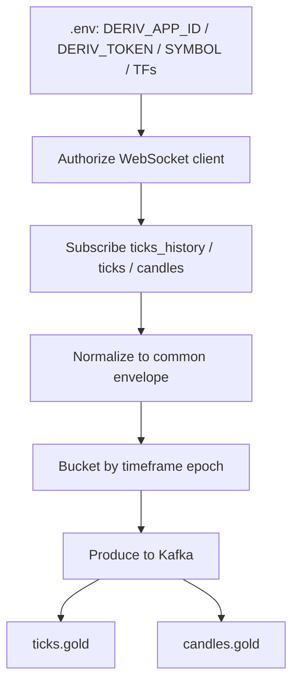
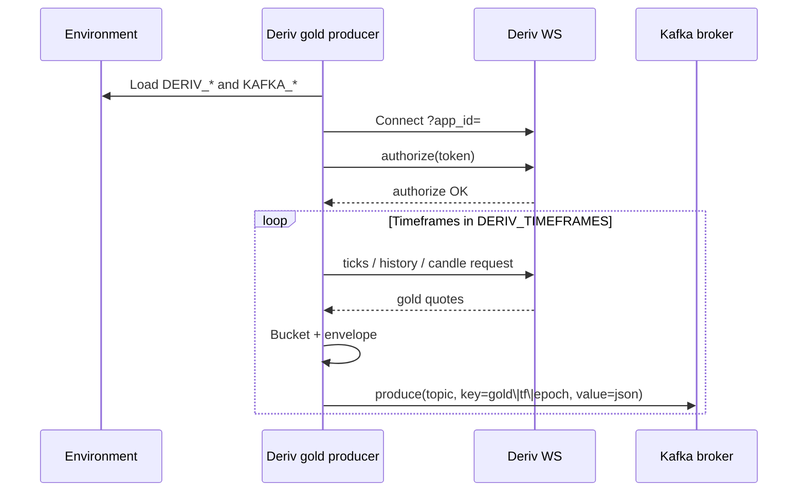

# Deriv gold → Kafka

Next ingest after Binance: Deriv **gold** ticks / candles → Kafka, same envelope and **time-based partition** scheme.

No producer code in this pass — contracts and flow only. Later implementation notes append to this same doc.

## Goal

```text
Deriv WebSocket  →  normalize gold (1s / 1m / 2m / 3m / …)  →  Kafka ticks.gold + candles.gold
```

## Flow chart



## Auth (client app → env)

Deriv uses `app_id` on the WebSocket URL and a **token** with trade/read scopes as needed.

| Variable | Required | Purpose |
|----------|----------|---------|
| `DERIV_APP_ID` | No (default test `1089`) | App id query param |
| `DERIV_TOKEN` | Yes | Authorize |
| `DERIV_WS_ENDPOINT` | No | Default `wss://ws.derivws.com/websockets/v3` |
| `DERIV_SYMBOL` | Yes | Gold symbol, e.g. `frxXAUUSD` (confirm in Deriv) |
| `DERIV_TIMEFRAMES` | Yes | e.g. `1s,1m,2m,3m` |
| `KAFKA_BOOTSTRAP_SERVERS` | Yes | e.g. `localhost:9092` |
| `KAFKA_TOPIC_TICKS_GOLD` | No | Default `ticks.gold` |
| `KAFKA_TOPIC_CANDLES_GOLD` | No | Default `candles.gold` |

## Time series (gold)

| Timeframe | Role |
|-----------|------|
| `1s` | Align with BTC 1s for cross-entity timing |
| `1m` | Primary higher TF |
| `2m` | Mid structure |
| `3m` | Mid structure |
| `5m` | Later / env list |

Build higher TFs from ticks or Deriv candle APIs where available; document exact API calls when coding.

## Kafka publish rules

Same rules as Binance, different entity/topics:

1. **Topics:** `ticks.gold`, `candles.gold`
2. **Key:**

   ```text
   gold|{timeframe}|{bucket_epoch}
   ```

3. **Value envelope:**

   ```json
   {
     "entity": "gold",
     "source": "deriv",
     "symbol": "frxXAUUSD",
     "timeframe": "1m",
     "bucket_epoch": 1710000000,
     "event_time_ms": 1710000000890,
     "payload": {
       "open": 0,
       "high": 0,
       "low": 0,
       "close": 0,
       "volume": 0,
       "trade_count": 0
     }
   }
   ```

   Deriv “volume” may be tick-count or quote-size proxy when true volume is absent — note that in implementation.

## Sequence diagram



## Alignment with Binance

```mermaid
flowchart LR
  subgraph second_T["Wall clock second T"]
    B[btc\|1s\|T → candles.btc]
    G[gold\|1s\|T → candles.gold]
  end
  W[Future worker joins on bucket_epoch]
  B --> W
  G --> W
```

Both producers must use the **same epoch bucketing** (UTC second / minute floors) so workers can compare BTC and gold on one timeline.

See [binance-time-series-kafka.md](../../binance/producer/binance-time-series-kafka.md).

## Future code location

```text
workers/ingest/deriv/   # or producers/deriv/
```

Docs only until the Binance producer path is implemented and validated.

## Out of scope here

- Volume-window / perspective candles
- Materials topic
- Trade placement on Deriv
- FastAPI surface
