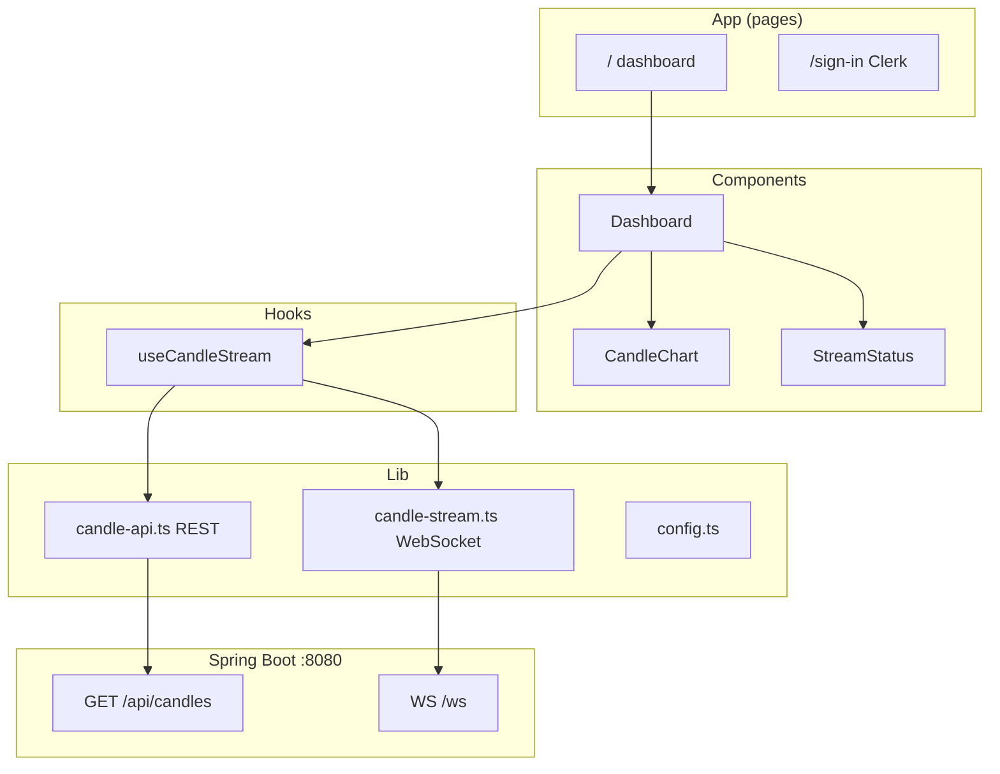

# Next.js candle stream UI

Live charts for **Binance BTC** and **Deriv gold** candles. Data path:

```text
Workers → Kafka → Spring Boot → WebSocket /ws + REST /api/candles → Next.js
```

## Layer flow (frontend)



| Layer | Path | Role |
|-------|------|------|
| **Page** | `src/app/dashboard/page.tsx` | Route shell, Clerk user menu |
| **Component** | `src/components/Dashboard.tsx` | Tabs Binance / Gold, timeframe select |
| **Component** | `src/components/CandleChart.tsx` | `lightweight-charts` candlestick |
| **Hook** | `src/hooks/useCandleStream.ts` | History + live merge |
| **Lib / API** | `src/lib/api/candle-api.ts` | `GET /api/candles`, `/health` |
| **Lib / stream** | `src/lib/stream/candle-stream.ts` | Raw WebSocket client + filter |
| **Types** | `src/types/candle.ts` | `CandleEnvelope` contract |
| **Auth** | Clerk + `src/middleware.ts` | Protect `/dashboard` when keys set |

## Code location

```text
frontend/
  src/app/              pages + layout
  src/components/       UI
  src/hooks/            useCandleStream
  src/lib/api/          REST client
  src/lib/stream/       WebSocket client
  src/types/            DTO types
  .env.example
```

## Env

Copy `frontend/.env.example` → `frontend/.env.local`:

| Variable | Required | Example |
|----------|----------|---------|
| `NEXT_PUBLIC_API_URL` | Yes | `http://localhost:8080` |
| `NEXT_PUBLIC_WS_URL` | Yes | `ws://localhost:8080/ws` |
| `NEXT_PUBLIC_CLERK_PUBLISHABLE_KEY` | No* | Clerk dashboard |
| `CLERK_SECRET_KEY` | No* | Clerk dashboard |

\*If Clerk keys are **empty**, dashboard is **open** (local dev). Set keys to require sign-in.

Spring Boot must allow CORS from Next:

```env
CORS_ALLOWED_ORIGINS=http://localhost:3000
```

## Run (full stack)

```bash
# 1 Kafka
cd local-env && docker compose up -d

# 2 Producers
cd workers && cp .env.example .env && uv sync
uv run uvicorn app.main:app --host 0.0.0.0 --port 8000

# 3 Spring Boot
cd realtime-spring
export SPRING_KAFKA_BOOTSTRAP_SERVERS=localhost:9092
export CORS_ALLOWED_ORIGINS=http://localhost:3000
mvn spring-boot:run

# 4 Frontend
cd frontend && cp .env.example .env.local && npm install && npm run dev
```

Open: **http://localhost:3000/dashboard**

## WebSocket contract

1. Connect `NEXT_PUBLIC_WS_URL` (default `ws://localhost:8080/ws`).
2. On open, send filter:

   ```json
   { "entity": "btc", "timeframe": "1m" }
   ```

3. Server pushes candle JSON (same as Kafka envelope).
4. Change tab/timeframe → send new filter JSON on same socket.

## REST history

On tab/timeframe change, UI loads last candles before live stream:

```http
GET /api/candles?entity=btc&timeframe=1m
```

## UI tabs

| Tab | Entity | Default TF |
|-----|--------|------------|
| Binance BTC | `btc` | `1m` |
| Deriv Gold | `gold` | `1m` |

Timeframe dropdown per entity (see `src/lib/config.ts`).

## Out of scope

- Volume / materials workers
- Trade placement
- Clerk JWT passed to Spring WebSocket (add later)
