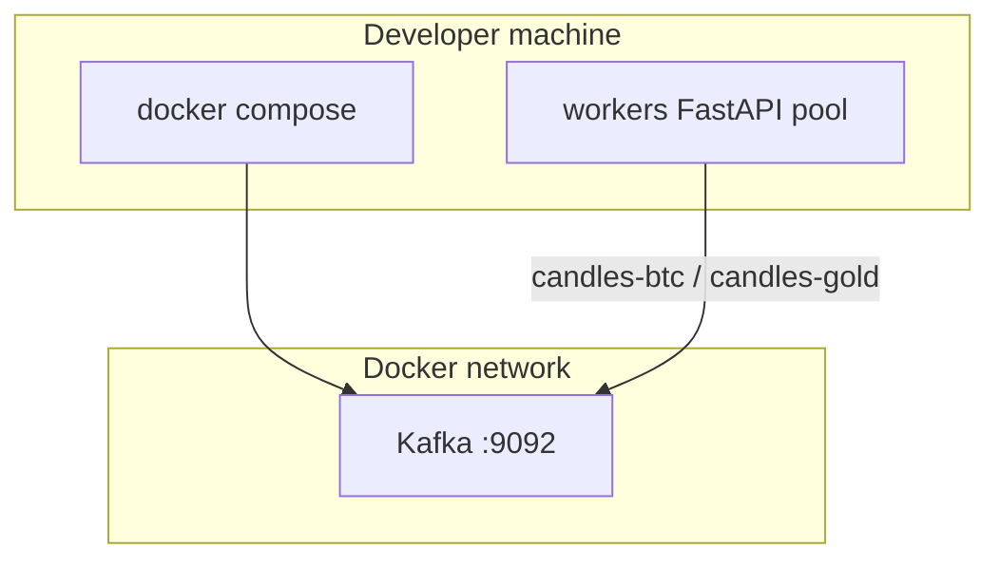

# Local Kafka (Docker)

Run a single-node Kafka (KRaft mode, no Zookeeper) for Binance and Deriv **candle** producers.

## Compose location

```text
local-env/docker-compose.yml
```

### Start / stop

```bash
cd local-env
docker compose up -d
docker compose ps
docker compose down          # keep volume
docker compose down -v       # wipe Kafka data
```

Broker:

| Client | Bootstrap |
|--------|-----------|
| Host (producers on your machine) | `localhost:9092` |
| Other containers on the compose network | `kafka:29092` |

## Topics (Phase 1) — candles only

| Topic | Producer | Payload |
|-------|----------|---------|
| `candles-btc` | Binance | BTC OHLCV bars (`1s`, `2s`, `1m`, …) |
| `candles-gold` | Deriv | Gold OHLCV bars (`1s`, `1m`, `2m`, `3m`, …) |

No tick topics. Producers may use live price feeds internally to **build** 1s candles, but Kafka only stores candle time series.

Create topics after the broker is healthy (example):

```bash
docker compose exec kafka \
  /opt/kafka/bin/kafka-topics.sh --bootstrap-server localhost:9092 \
  --create --if-not-exists --topic candles-btc --partitions 6 --replication-factor 1

docker compose exec kafka \
  /opt/kafka/bin/kafka-topics.sh --bootstrap-server localhost:9092 \
  --create --if-not-exists --topic candles-gold --partitions 6 --replication-factor 1
```

(Compose `kafka-init-topics` also creates these on first start.)

Topic names use **hyphens only** (`candles-btc`) — avoids Kafka JMX metric warnings from mixing `.` and `_`.

### If Kafka container is not running

```bash
cd local-env
docker compose down
docker compose up -d kafka
docker compose logs -f kafka
```

Wait until healthy, then run init (or full up):

```bash
docker compose up -d
docker compose ps
```

Expected: `ai-trading-kafka` **Up (healthy)**. `ai-trading-kafka-init` **Exited (0)** — that is normal.

If broker keeps crashing after an upgrade, reset data volume:

```bash
docker compose down -v
docker compose up -d
```

Update app env to match new topic names (`candles-btc`, `candles-gold`) in `workers/.env` and Spring env.

## Partition by time

Producers do **not** use a random key. They set:

```text
key = "{entity}|{timeframe}|{bucket_epoch}"
```

Examples:

| Message | Key |
|---------|-----|
| BTC 1s candle at epoch `1710000000` | `btc\|1s\|1710000000` |
| BTC 1m candle at epoch `1710000000` | `btc\|1m\|1710000000` |
| Gold 1s candle | `gold\|1s\|1710000001` |

### Why

```mermaid
flowchart LR
  subgraph same_second["Same wall-clock second"]
    B1[btc\|1s\|T]
    G1[gold\|1s\|T]
  end

  subgraph kafka_p["Kafka partitions"]
    P0[P0]
    P1[P1]
    P2[P2]
  end

  B1 -->|hash key| P1
  G1 -->|hash key| P2
```

- Same entity + TF + bucket always map to the **same partition** → ordered history per series.
- Workers can later join on `bucket_epoch` across topics.

## Message shape (contract sketch)

```json
{
  "entity": "btc",
  "source": "binance",
  "symbol": "BTCUSDT",
  "timeframe": "1s",
  "bucket_epoch": 1710000000,
  "event_time_ms": 1710000000123,
  "payload": {
    "open": 0,
    "high": 0,
    "low": 0,
    "close": 0,
    "volume": 0,
    "trade_count": 0
  }
}
```

## Diagram: infra boundary



## Env (infra)

See `local-env/.env.example`. Producers use `workers/.env`:

```env
KAFKA_BOOTSTRAP_SERVERS=localhost:9092
KAFKA_TOPIC_CANDLES_BTC=candles-btc
KAFKA_TOPIC_CANDLES_GOLD=candles-gold
```

Producer workers: `workers/app/` — Binance + Deriv publish **candles only**.

UI live path: [springboot-kafka-websocket.md](../springboot/websocket/springboot-kafka-websocket.md) — Spring Boot app in `realtime-spring/`.
