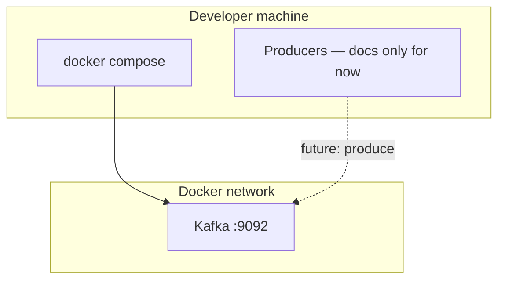

# Local Kafka (Docker)

Run a single-node Kafka (KRaft mode, no Zookeeper) for Binance and Deriv producers.

## Compose location

```text
local-env/docker-compose.yml
```

### Start / stop

```bash
cd local-env
docker compose up -d
docker compose ps
docker compose down          # keep volume
docker compose down -v       # wipe Kafka data
```

Broker:

| Client | Bootstrap |
|--------|-----------|
| Host (producers on your machine) | `localhost:9092` |
| Other containers on the compose network | `kafka:29092` |

## Topics (Phase 1)

| Topic | Producer | Payload |
|-------|----------|---------|
| `ticks.btc` | Binance | Normalized 1s-aligned ticks / trades |
| `candles.btc` | Binance | Candle bars for `1s`, `2s`, `1m`, … |
| `ticks.gold` | Deriv | Normalized gold ticks |
| `candles.gold` | Deriv | Candle bars for `1s`, `1m`, `2m`, `3m`, … |

Create topics after the broker is healthy (example):

```bash
docker compose exec kafka \
  /opt/kafka/bin/kafka-topics.sh --bootstrap-server localhost:9092 \
  --create --if-not-exists --topic ticks.btc --partitions 6 --replication-factor 1

docker compose exec kafka \
  /opt/kafka/bin/kafka-topics.sh --bootstrap-server localhost:9092 \
  --create --if-not-exists --topic candles.btc --partitions 6 --replication-factor 1

docker compose exec kafka \
  /opt/kafka/bin/kafka-topics.sh --bootstrap-server localhost:9092 \
  --create --if-not-exists --topic ticks.gold --partitions 6 --replication-factor 1

docker compose exec kafka \
  /opt/kafka/bin/kafka-topics.sh --bootstrap-server localhost:9092 \
  --create --if-not-exists --topic candles.gold --partitions 6 --replication-factor 1
```

(Exact `kafka-topics.sh` path may match the image; adjust if the image uses `/opt/bitnami/kafka` or similar.)

## Partition by time

Producers do **not** use a random key. They set:

```text
key = "{entity}|{timeframe}|{bucket_epoch}"
```

Examples:

| Message | Key |
|---------|-----|
| BTC 1s candle at epoch `1710000000` | `btc\|1s\|1710000000` |
| BTC 1m candle at epoch `1710000000` | `btc\|1m\|1710000000` |
| Gold 1s tick bucket | `gold\|1s\|1710000001` |

### Why

```mermaid
flowchart LR
  subgraph same_second["Same wall-clock second"]
    B1[btc\|1s\|T]
    G1[gold\|1s\|T]
  end

  subgraph kafka_p["Kafka partitions"]
    P0[P0]
    P1[P1]
    P2[P2]
  end

  B1 -->|hash key| P1
  G1 -->|hash key| P2
```

- Same entity + TF + bucket always map to the **same partition** → ordered history per series.
- Workers can later join on `bucket_epoch` across topics without guessing partition layout.
- Partition **count** (e.g. 6) is infra config; key scheme stays stable if we scale partitions later (revisit rebalancing if we change key format).

Optional refinement later: use `bucket_epoch` alone as key so BTC and gold for the same second share a partition (stricter co-location). Phase 1 docs keep entity in the key for clearer ordering per series.

## Message shape (contract sketch)

Envelope for both Binance and Deriv producers:

```json
{
  "entity": "btc",
  "source": "binance",
  "timeframe": "1s",
  "bucket_epoch": 1710000000,
  "event_time_ms": 1710000000123,
  "payload": {}
}
```

`payload` holds OHLCV for candles or price/qty for ticks. Exact fields live in producer docs.

## Diagram: infra boundary



## Env (infra)

See `local-env/.env.example`. Producers use separate env files (API keys); Kafka only needs bootstrap servers:

```env
KAFKA_BOOTSTRAP_SERVERS=localhost:9092
```

Related docs: [infrastructure-overview.md](infrastructure-overview.md), [main-architecture.md](../main-architecture.md).
