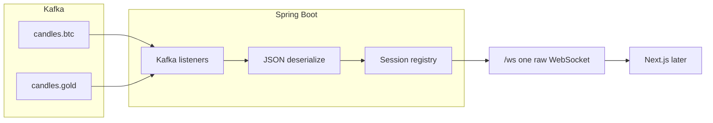
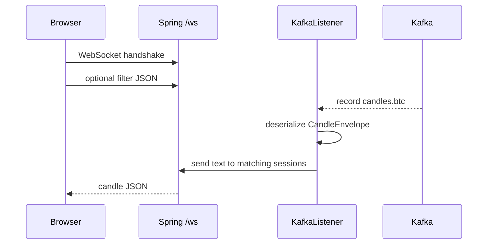
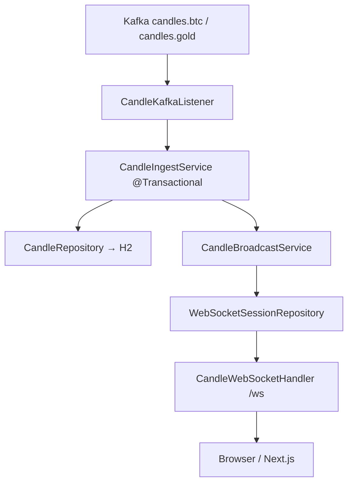

# Spring Boot WebSocket — Kafka candles

Docs only. Spring Boot API is **WebSocket only**: consume Kafka candles, deserialize, push on **one raw WebSocket**.

No STOMP. No REST CRUD. Clerk / Next.js attach later.

## Why not STOMP

STOMP is an extra messaging protocol on top of WebSocket (`CONNECT`, `SUBSCRIBE`, `/topic/...`). Spring likes it for many destinations. We only need **one socket** and candle JSON — raw WebSocket is enough.

```text
candles.btc + candles.gold  →  Spring Boot consumer  →  deserialize  →  ws://…/ws  →  UI
```

## Flow



## One WebSocket

| Piece | Value |
|-------|--------|
| Handshake | `ws://localhost:8080/ws` |
| Protocol | Native WebSocket (text frames) |
| Payload | Same candle JSON as Kafka |

Browser: `new WebSocket("ws://localhost:8080/ws")`. No `@stomp/stompjs`.

Optional first client message to filter (still one connection):

```json
{ "entity": "btc", "timeframe": "1s" }
```

- Omit / empty → server sends **all** candles (Binance + Gold, all TFs). UI tabs filter.
- `{ "entity": "btc" }` → BTC only.
- `{ "entity": "gold", "timeframe": "1m" }` → gold 1m only.

Server keeps a map of `WebSocketSession` → filter. Kafka listener deserializes, then `session.sendMessage(TextMessage)` to matching sessions.

## Deserialize

Kafka value is UTF-8 JSON (see [kafka-local.md](../../infrastructure/kafka-local.md)).

Jackson maps to one DTO. Do **not** treat Kafka records as ticks.

```text
CandleEnvelope
  entity          String    btc | gold
  source          String    binance | deriv
  symbol          String
  timeframe       String    1s | 2s | 1m | 2m | 3m | …
  bucketEpoch     long
  eventTimeMs     long
  payload         CandleOhlcv
    open, high, low, close, volume, tradeCount
```

JSON field names stay snake_case on the wire (`bucket_epoch`, `event_time_ms`, `trade_count`). Use `@JsonProperty` on the DTO.

Key (partition by time), not deserialized into the body:

```text
{entity}|{timeframe}|{bucket_epoch}
```

Ignore unknown properties so producer extras (`source_interval`) do not break the listener.

## Kafka consume (Spring)

| Setting | Value |
|---------|--------|
| Bootstrap | `localhost:9092` |
| Topics | `candles.btc`, `candles.gold` |
| Group | `spring-websocket-candles` |
| Key deserializer | `StringDeserializer` |
| Value deserializer | `StringDeserializer` then Jackson, **or** `JsonDeserializer` bound to `CandleEnvelope` |
| Start | `latest` for live UI; `earliest` only for local replay |

One `@KafkaListener` on both topics. After deserialize, fan out the **same JSON** on `/ws` to sessions whose filter matches `entity` + `timeframe`.

## Sequence



## Env (Spring, later)

```env
SPRING_KAFKA_BOOTSTRAP_SERVERS=localhost:9092
KAFKA_TOPIC_CANDLES_BTC=candles.btc
KAFKA_TOPIC_CANDLES_GOLD=candles.gold
KAFKA_GROUP_ID=spring-websocket-candles
SERVER_PORT=8080
```

CORS / allowed origins for Next.js when the UI exists. Clerk JWT on handshake is **out of scope**.

## Implemented code location

```text
realtime-spring/
  src/main/java/com/aitrading/realtime/
    controller/     HealthController, CandleHistoryController, CandleWebSocketHandler
    service/        CandleIngestService, CandleBroadcastService, CandleQueryService
    repository/     CandleRepository (JPA), WebSocketSessionRepository (in-memory)
    entity/         CandleEntity
    dto/            CandleEnvelopeDto, ClientFilterDto, …
    validation/     CandleEnvelopeValidator, ClientFilterValidator
    exception/      GlobalExceptionHandler, ApiException
    config/         WebSocketConfig, SecurityConfig, KafkaConfig
    kafka/          CandleKafkaListener
```

Run:

```bash
cd realtime-spring
mvn spring-boot:run
```

WebSocket: `ws://localhost:8080/ws`  
History: `GET /api/candles?entity=btc&timeframe=1s`  
Health: `GET /health`

## Layer flow



| Layer | Class | Role |
|-------|-------|------|
| **Controller** | `CandleWebSocketHandler`, `HealthController`, `CandleHistoryController` | HTTP + raw WebSocket entry |
| **Service** | `CandleIngestService` | Validate DTO, `@Transactional` save, trigger broadcast |
| **Service** | `CandleBroadcastService` | Filter + send JSON to open sessions |
| **Service** | `CandleQueryService` | Recent candles from DB, session registry |
| **Repository** | `CandleRepository` | JPA → H2 `candles` table |
| **Repository** | `WebSocketSessionRepository` | In-memory session + client filter |
| **DTO** | `CandleEnvelopeDto`, `ClientFilterDto` | Kafka + WS contract |
| **Validation** | `CandleEnvelopeValidator`, `ClientFilterValidator` | Jakarta Bean Validation |
| **Exception** | `GlobalExceptionHandler` | REST error responses |
| **Security** | `SecurityConfig` | CORS, permit local `/ws` + `/api/**` (Clerk later) |
| **Transaction** | `@Transactional` on `CandleIngestService.ingestFromKafka` | Upsert candle row atomically |

UI: [nextjs-candle-stream-ui.md](../frontend/nextjs-candle-stream-ui.md) — Next.js charts from `/ws` + `/api/candles`.
- Producer / FastAPI workers
- Tick topics
- REST history API
- Clerk auth on the socket
- Next.js charts
- Volume / materials consumers
