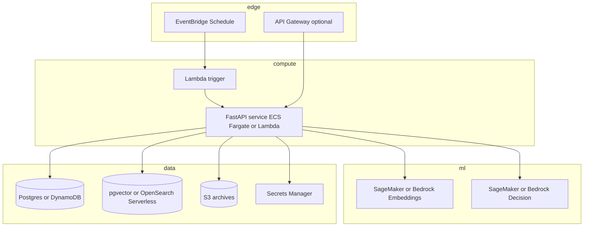

# Platform breakdown — agents, API, data & RAG, infrastructure

Companion to **`architecture-deriv-multi-agent.md`**. This doc is the **implementation-facing** split: who does what, which HTTP surface to build, which **DB / RAG shapes** to store, and which **AWS pieces** connect them.

---

## Table of contents

1. [Agents](#1-agents)
2. [API (FastAPI)](#2-api-fastapi)
3. [Data models (DB) and RAG models](#3-data-models-db-and-rag)
4. [Infrastructure breakdown](#4-infrastructure-breakdown)
5. [Consolidation options (fewer moving parts)](#5-consolidation-options-fewer-moving-parts)

---

## 1. Agents

Each row is a **logical agent** (can be a Python module or class; not required to be a separate microservice on day one).

| Agent | Inputs | Outputs | Notes |
|-------|--------|---------|--------|
| **Orchestrator** | Run config (symbol, `TRADES_PER_RUN`, MM policy, `run_id`), schedule idempotency key | Orders sub-steps; final run status; enforces **stop** after N trades or on error | Owns the **state machine**: `IDLE` → `RUNNING` → `CYCLE_COMPLETE` / `SLEEP` |
| **Data agent** | Symbol, timeframe, time range or “last M bars” | Normalized OHLC/tick windows; **pre-trade** and **post-trade** slices for the card API | Feeds indicator tools and the trade card |
| **Indicator / strategy** | Windows + strategy name + params from config | **Signal** (e.g. long/short/none), **indicator snapshot** (dict or JSON), **TA category** tags | Implemented as **tools** (pure functions) from ported `deriv_bot_ai` code |
| **Memory / RAG** | Query: “last 5/10” + optional semantic text; **upsert** after each close | Retrieved **chunks** + metadata; new **vector id** on write | **Read path**: exact N from DB + optional vector search |
| **Direction / decision** | Signal + RAG snippets + optional guardrail flags | `action`: `call` / `put` / `skip`, `confidence`, optional `duration` | Backed by **SageMaker** or **Bedrock** endpoint (versioned) |
| **Money management (MM)** | `available_risk`, `stake` history in cycle, `MM_*` config, result of last trade (W/L) | Next **stake**, updated **available risk** | Must match **verified** spreadsheet / formula version |
| **Guardrail (optional)** | Spread, volatility, daily PnL, news flag | `allow` / `veto` / `reduce_stake` + reason | Prevents runaway loss; can be rules-only at first |
| **Execution bridge** (not an “LLM agent”) | Final action, stake, contract params | Call **Deriv API**; return **fill** and **outcome** | Keep **keys** and **idempotency** out of the LLM path |

**Control flow (one trade attempt):**  
Data → Indicators → (RAG read) → Guardrail → MM (stake) → Decision → Execution → Persist trade → (RAG write).

---

## 2. API (FastAPI)

Public surface for **operators** and **UI**. Internal Lambda/orchestrator can call the **same** functions via a shared Python package to avoid duplicating logic.

### 2.1 Route groups

| Group | Purpose |
|-------|---------|
| **Health** | Liveness/readiness for load balancer |
| **Runs** | Start (manual), status, list |
| **Trades** | List/filter trades; **trade card** (rich detail) |
| **Config (admin)** | Read-only policy snapshot in prod; optional secured write |

### 2.2 Suggested endpoints (contract sketch)

| Method | Path | Description |
|--------|------|-------------|
| `GET` | `/health` | OK + dependency checks (DB, optional vector) |
| `GET` | `/ready` | Stricter: DB + broker ping if allowed |
| `POST` | `/runs` | Body: optional overrides (`trades_per_run`, `symbol`). Returns `run_id` |
| `GET` | `/runs` | Query: pagination, status filter |
| `GET` | `/runs/{run_id}` | Status, trades executed, errors, next wake time |
| `GET` | `/trades` | Query: `from`, `to`, `symbol`, `result`, pagination |
| `GET` | `/trades/{trade_id}` | Single trade facts |
| `GET` | `/trades/{trade_id}/card` | **Card**: pre-window OHLC+indicators, post-window, PnL, MM snapshot, RAG snippets, model versions |

**Auth:** API key, JWT, or IAM (API Gateway + SigV4) depending on deployment; not optional for prod.

**Errors:** Use stable `error_code` + HTTP status; never return secrets.

---

## 3. Data models (DB) and RAG

### 3.1 OLTP — trade and run facts (Postgres or DynamoDB)

**Goal:** exact queries, audit, money reconciliation. Vectors are **not** required here.

**`runs`** (or single-table PK `RUN#<id>` if Dynamo)

| Field | Type | Description |
|-------|------|-------------|
| `run_id` | UUID / string | Primary key |
| `started_at`, `ended_at` | datetime | |
| `status` | enum | `running`, `completed`, `failed`, `sleeping` |
| `schedule_trigger_id` | string | Idempotency (EventBridge/Lambda request id) |
| `trades_planned`, `trades_executed` | int | |
| `error_message` | text | nullable |

**`trades`**

| Field | Type | Description |
|-------|------|-------------|
| `trade_id` | UUID | PK |
| `run_id` | FK | |
| `symbol`, `timeframe` | string | |
| `opened_at`, `closed_at` | datetime | |
| `result` | enum | `win`, `loss` |
| `stake`, `profit` | decimal | |
| `available_risk_after` | decimal | MM running capital |
| `direction` | enum | `call`, `put` |
| `strategy_name`, `strategy_version` | string | |
| `indicator_snapshot` | JSON | Frozen bar-level or indicator values at decision |
| `ta_categories` | string[] or JSON | Tags |
| `cycle_index` | int | 1..`MM_CYCLE_LEN` |
| `mm_formula_version` | string | |
| `decision_model_version`, `embedding_model_version` | string | Audit |
| `rag_document_id` | string | nullable; links to vector row |
| `skip_reason` | string | nullable if trade not placed |

**Optional `trade_windows`** if you store large OHLC arrays separately: `trade_id`, `pre_json`, `post_json`, `s3_uri`.

### 3.2 RAG — vector documents

**Goal:** semantic retrieval (“similar regimes”), not replacing the trade ledger.

**Vector table** (e.g. `rag_documents` with **pgvector**, or OpenSearch document)

| Field | Description |
|-------|-------------|
| `id` | UUID |
| `trade_id` | FK to trades (optional but recommended) |
| `embedding` | vector(float)[dim] |
| `content_text` | Short narrative for embedding (outcome + key indicators + regime) |
| `metadata` | JSON: `symbol`, `closed_at`, `strategy`, `ta_categories`, `window_size_hint` |
| `embedding_model_version` | string |

**Retrieval policy**

- **Exact:** last N trades from **`trades`** (always).
- **Semantic:** top-K from **`rag_documents`** filtered by `symbol` / time window as needed.

### 3.3 Object storage (S3) — optional layer

| Use | Example key pattern |
|-----|---------------------|
| Raw tick archives | `s3://…/symbol=…/date=…/part.parquet` |
| Large window payloads | `…/trades/{trade_id}/pre_window.json` |
| Model/bundle artifacts | SageMaker or your own versioned prefix |

S3 is **not** a replacement for SQL or vectors; it holds **blobs**.

---

## 4. Infrastructure breakdown

### 4.1 Diagram (logical AWS layout)

### 4.2 Component responsibilities

| Component | Responsibility |
|-----------|----------------|
| **EventBridge** | Fire **every 2h** (or cron); pass **constant JSON** or rely on env in Lambda |
| **Lambda** | **Thin**: validate secret, **invoke** orchestrator (HTTP to internal API, or direct import if same container image with layers) |
| **FastAPI** | REST for UI/operators; shared library for **orchestrator** if co-deployed |
| **ECS Fargate** | Long-running API + optional worker if Lambda timeout is too low |
| **SageMaker endpoints** | **Embedding** + **Decision** (or Bedrock for either) |
| **RDS Postgres + pgvector** | **Single** place for **trades + vectors** if you want fewer databases |
| **DynamoDB** | Alternative to RDS for **high-volume idempotent** writes (runs/trades); pair with OpenSearch for vectors |
| **S3** | Cheap retention of raw series and large JSON |
| **Secrets Manager / SSM** | `DERIV_TOKEN`, DB URLs, API keys |
| **CloudWatch** | Logs, metrics, alarms on errors and daily loss |

### 4.3 Networking and security (minimal list)

- API **not** open to the world without **auth**; prefer **private** ECS + API Gateway with JWT/API key, or **HTTPS + WAF** if public.
- Broker tokens **only** from Secrets Manager; **no** tokens in env vars in plain CI logs.
- SageMaker in **VPC** if RDS is private; **security groups** from API/worker to endpoints and DB.

### 4.4 Environment groups (for `.env` / Parameter Store)

| Group | Examples |
|-------|----------|
| **Broker** | `DERIV_APP_ID`, `DERIV_TOKEN` |
| **Run policy** | `TRADES_PER_RUN`, `MM_*`, `SCHEDULE` |
| **ML** | `EMBEDDING_MODEL_ID`, `DECISION_MODEL_ID`, endpoint names |
| **Data** | `DATABASE_URL`, `VECTOR_*`, `S3_BUCKET` |
| **API** | `CORS_ORIGINS`, `API_KEY`, `ENV` |

---

## 5. Consolidation options (fewer moving parts)

| Starting point | What you use |
|----------------|----------------|
| **Minimal** | Postgres + **pgvector** + FastAPI on one Fargate service; EventBridge → Lambda → **POST /runs**; no OpenSearch until scale demands it |
| **Separate vectors later** | Keep trades in Postgres; move embeddings to OpenSearch when semantic load grows |
| **No S3 at first** | Store indicator snapshots in JSON on `trades`; add S3 when windows get huge |

---

## Related docs

- **`architecture-deriv-multi-agent.md`** — end-to-end platform architecture and sequence
- **`agentic-ai-mental-map.md`** — generic agentic AI slots (control, orchestration, tools, memory)
