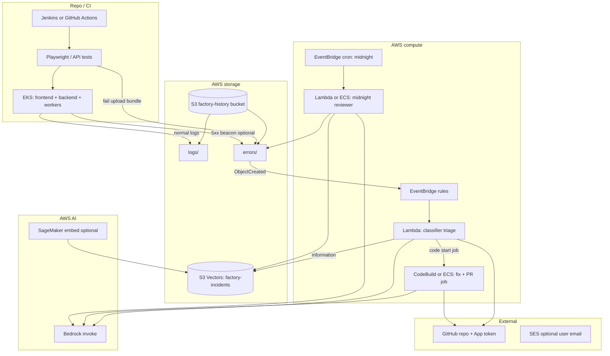
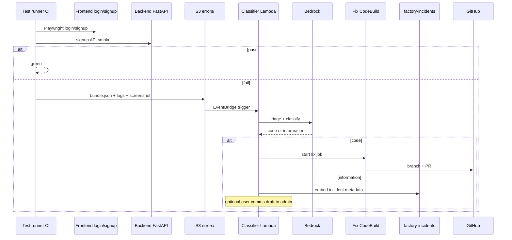
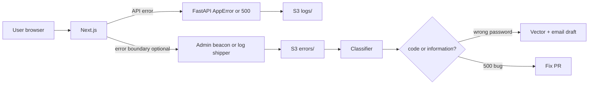
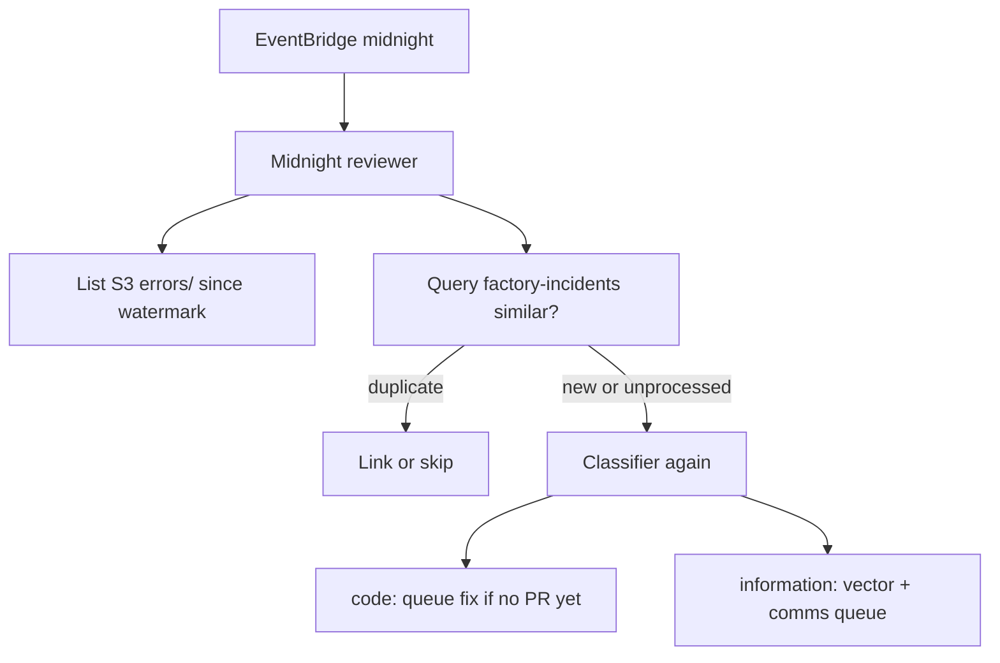

# Worker factory — phased plan

Documentation only. No Lambda, ECS, or CI code in this folder yet.

## Goal

Test the platform (UI login/signup, API, deploy smoke) → on failure upload evidence to S3 → classify error → Bedrock triage → optional fix PR or vector + user comms. **Separate** from trading `workers/executor/`.

## Flow

```text
[Test runner] scenarios (auth.login.ui, auth.signup.api, …)
  → fail → [Error capture] → S3 errors/<date>/<incident_id>/
  → [Classifier] code | information | unknown
       ├── code        → [Fix agent] → GitHub PR (Bedrock / human + Cursor on branch)
       └── information → [Vector writer] + optional [User comms] (admin-approved email)
  → [Midnight reviewer] batch: scan new errors/, dedupe via factory vector index
```

## Folder structure

Planned layout under `worker_factory/`. **Not all paths exist yet**—add folders/files as each phase ships.

```text
worker_factory/
├── README.md
├── PLAN.md                    # this file
├── prompts.md                 # Bedrock prompt drafts
│
├── docs/                      # (planned) split when this plan grows
│   ├── AGENTS.md              # agent responsibilities + triggers
│   ├── ERROR-TAXONOMY.md      # code vs information vs unknown
│   └── S3-LAYOUT.md           # logs/ vs errors/ prefixes
│
├── knowledge/                 # (planned) triage KB — no secrets
│   ├── components.md          # api, frontend-auth, workers, deploy
│   └── auth-runbook.md        # login/signup flows, common failures
│
├── schemas/                   # (planned) FailureBundle, classification, vector record
│   ├── failure_bundle.json
│   ├── incident_classification.json
│   └── vector_incident_record.json
│
├── tests_catalog/
│   └── scenarios.yaml         # scenario ids, severity hints for testers
│
├── tests/                     # (planned) factory-owned runners — targets frontend/backend
│   ├── playwright/            # UI: login, signup
│   ├── api/                   # HTTP smoke (signup, health)
│   └── helpers/               # build bundle, upload S3 on fail
│
├── agents/                    # (planned) one subfolder per logical agent
│   ├── test_runner/
│   ├── error_capture/
│   ├── classifier/
│   ├── vector_writer/
│   ├── user_comms/
│   ├── fix_agent/
│   └── midnight_reviewer/
│
├── tools/                     # (planned) shared: s3, bedrock, github, vector, redact
├── orchestrator/              # (planned) CI hook, EventBridge Lambda, midnight cron
└── infra/                     # (planned) factory bucket, IAM, EventBridge (or link to terraform)
```

### Agents → folders

| Agent | Folder | Responsibility |
|--------|--------|----------------|
| Test runner | `tests/`, `tests_catalog/` | Run login/signup and platform scenarios; tester/admin severity metadata |
| Error capture | `agents/error_capture/`, `tools/` | Build FailureBundle; write **errors/** (not normal **logs/**) |
| Classifier | `agents/classifier/` | `code` → fix path; `information` → vector/comms; never auto-fix wrong-password as code |
| Vector writer | `agents/vector_writer/` | Upsert **factory-incidents** index (not trade `trade-embeddings`) |
| User comms | `agents/user_comms/` | Email drafts from redacted context; v1 = admin approve, not auto-send |
| Fix agent | `agents/fix_agent/` | Clone latest GitHub, Bedrock diff, re-test, PR |
| Midnight reviewer | `agents/midnight_reviewer/` | Scheduled scan of `errors/`, dedupe, re-triage |

### S3 layout (factory history bucket)

```text
s3://<factory-history-bucket>/
├── logs/                      # normal app/request logs
└── errors/                    # incidents only (tests, 5xx, classified UI failures)
    └── <yyyy>/<mm>/<dd>/<incident_id>/
        ├── bundle.json
        ├── api_response.json
        ├── ui_console.log
        └── screenshot.png     # optional
```

### Repo areas the factory tests (unchanged location)

| Path | Factory concern |
|------|-----------------|
| `frontend/src/app/login/`, `signup/`, `api/auth/` | UI + signup tests, form/NextAuth errors |
| `backend/app/routes/`, `core/exceptions.py` | API status + `detail` in bundle |
| `workers/` | Trading runtime — **not** factory agents; optional smoke scenarios only |
| `deploy/`, `jenkins/` | Helm/terraform smoke scenarios |

## What can be added because of worker factory

New capabilities (do not mix into `workers/executor/`):

- **Auth regression tests** (Playwright + API) with structured failure artifacts.
- **Error vs log separation** in S3 for midnight batch and triage.
- **Classification gate** so only **code** errors open PRs; **information** errors go to vector DB + optional user email.
- **Factory vector index** for similar incidents and fix history (separate from trade RAG).
- **Admin/tester metadata** on scenarios (severity, error level) for triage hints.
- **Midnight job** to re-process `errors/` like a repeat test flow.
- **Allowlisted auto-fix** paths: `frontend/`, `backend/`, `tests/`, `worker_factory/`, `deploy/` — not secrets or `.env`.

## Phase 1 — Safety

- Factory IAM: read S3 history, Bedrock invoke, GitHub PR scope — no trade execution or infra destroy.
- All changes via PR; allowlisted paths only (`tests/`, `workers/`, `deploy/`, `worker_factory/`, `docs/`, `frontend/`, `backend/`).
- Redact secrets in CI artifacts (passwords, tokens, `AUTH_SECRET`).

## Phase 2 — Failure capture

S3 prefix `errors/<date>/<incident_id>/`: `bundle.json`, `api_response.json`, optional `ui_console.log`, `junit.xml`. Fields: `scenario_id`, `severity`, `commit_sha`, `ci_run_url`, `error_summary`, optional redacted `user_hint`.

## Phase 3 — Triage + classify (Lambda)

Load bundle + `knowledge/` → Bedrock → GitHub issue/comment + `error_class`. No git clone in Lambda.

## Phase 4 — Fix + PR (CodeBuild/ECS)

Only when `error_class=code`. Clone at `commit_sha`, Bedrock diff (`prompts.md`), re-run scenario, push `factory/fix-<id>`, open PR. Cursor/Antigravity = optional human step on same branch.

## Phase 5 — Incident memory + midnight

- Factory S3 Vectors index (e.g. `factory-incidents`) for information incidents and resolved fixes.
- EventBridge schedule → midnight reviewer lists new `errors/`, dedupes, routes to classifier/fix/comms.

---

## AWS overview (how pieces connect)

Keep **trade** RAG (`trade-embeddings`, workers IRSA on EKS) **separate** from factory IAM and buckets.



### AWS setup checklist

| Step | AWS resource | Purpose |
|------|----------------|--------|
| 1 | **S3 bucket** e.g. `deriv-ai-bot-factory-history` (new; not trade vectors bucket) | `logs/` + `errors/` |
| 2 | **S3 Vectors** bucket + index `factory-incidents` (384-dim, cosine) | Similar incidents / midnight dedupe; can reuse SageMaker embed endpoint |
| 3 | **IAM role** e.g. `deriv-factory-worker` | S3 factory bucket; `s3vectors:QueryVectors` / `PutVectors` on factory index; `bedrock:InvokeModel`; **no** trade execution / EKS admin |
| 4 | **Lambda** + **EventBridge** on `s3:ObjectCreated` under `errors/` | Classifier triage (Phase 3) |
| 5 | **CodeBuild** or **ECS** + optional **Step Functions** | Fix agent: clone, patch, re-test, PR (Phase 4) |
| 6 | **Secrets Manager** | GitHub App key; optional SES |
| 7 | **EventBridge schedule** e.g. `cron(0 0 * * ? *)` UTC | Midnight reviewer (Phase 5) |
| 8 | **Bedrock** model enabled in region (e.g. `us-west-1`) | Triage + fix prompts |
| 9 | **CI/Jenkins** IAM or OIDC | Upload to `errors/` on test failure |

### What runs where (today vs later)

| Piece | In repo today | In AWS when built |
|--------|----------------|-------------------|
| Auth UI/API | `frontend` login/signup, `backend` routes | Tested by CI |
| Factory plan | `worker_factory/PLAN.md` | — |
| Classifier / fix / midnight | Not implemented | Lambda, CodeBuild, EventBridge |
| Trading bot | `workers/` on EKS | Unchanged |

### One-page mental model

```text
                    ┌─────────────────────────────────────┐
                    │           AWS (factory)              │
                    │  S3 logs/ + errors/  │  S3 Vectors   │
                    │  Bedrock  │  Lambda  │  CodeBuild   │
                    └───────────┬─────────────────────────┘
                                │
     Flow A (tests) ────────────┼── CI fail → errors/ → classify → PR or vector
     Flow B (live)  ────────────┼── app error → errors/ → same classifier
     Flow C (night) ───────────┴── cron → scan errors/ → dedupe → classify again
```

---

## Three main flows

### Flow A — Testing (login/signup + smoke)

Primary path to build first.



- **When:** every CI run or manual “run auth suite.”
- **Chain:** Test runner → Error capture → Classifier → Fix **or** Vector (+ comms later).

### Flow B — Live app / runtime error

Same pipeline when a real user hits an error (optional v2).



- **When:** staging/production incident, not only CI.
- **Rules:** redact password/tokens; store hashed `user_id` or email domain only in vector metadata.

### Flow C — Midnight batch

Re-process incidents that landed in `errors/` (missed events, dedupe, retry `unknown`).



- **When:** once per night (or every 6h).
- **Why:** catch missed EventBridge deliveries; dedupe repeated login errors; retry classification.

---

## Prompts

See [prompts.md](prompts.md).
